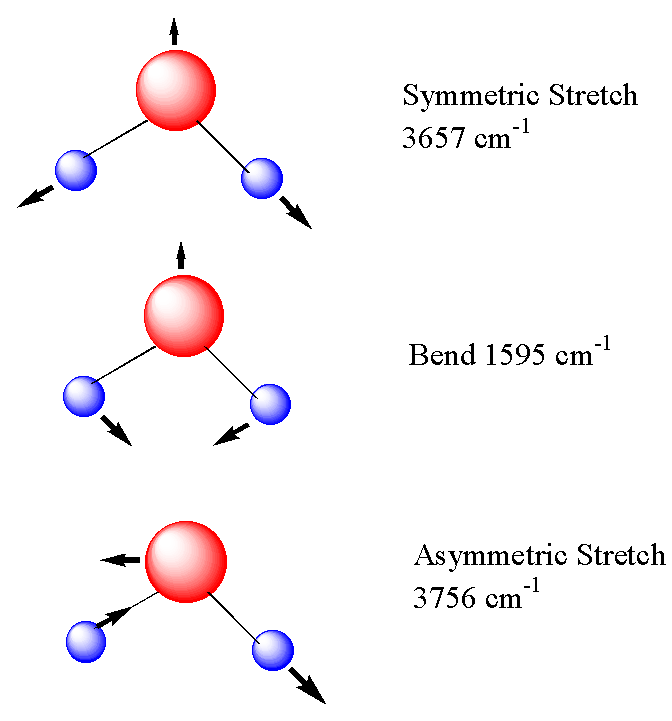

# normal\_mode\_displacer

## Description
Displace atomic coordinates along molecular normal modes.



## Requirements

- Gaussian quantum chemistry package
- python2.7

## How to use

### Files

1. equilibrium.xyz, the equilibrium geometry (lowest energy geometry from an opt calculation).

2. normalmodes.txt, contains the normal modes from a Gaussian (g09) calculation with freq=hpmodes option enabled.

3. variables.py, contains user defined variables.

4. run.py, run this to start generating randomly displaced geometries (xyz files).

### Functions

No need to edit these:

- displace\_coords.py, displace equilibrium.xyz coordinates along the normal modes 

- read\_displacements.py, read displacement factors from normalmodes.txt

- rw\_xyz.py, read or write xyz files 

- Z2m.py, converts between atom name (H,C,N,O, etc.) or atomic number to atomic mass

### Usage

First run a Gaussian (g09) calculation with "freq=hpmodes". Then create the file 'normalmodes.txt' from the frequencies section of the .log file. And make sure 'equilibrium.xyz' is the optimised geometry from the same .log file. An example calculation for water (input file and resulting log file) are in the g09 directory.

To begin creating new geometries from this, open `variables.py':

```python
# Number of random geometries to generate
N = 1000

# switch on (1) or off (0) random displacements
randm = 1

# if randm is on the random displacement will be in range [-a,a], if randm is off it will displace by exactly a
a = 3

# frequencies (cm-1) of selected modes
freqcm1 = [1722.4496, 3799.4476, 3925.0128] 

# selected modes
#Modes = [1,2,3]
nmodes = len(freqcm1)
Modes = list(range(1, nmodes + 1 ))  # all modes
```

``N`` is the number of geometries that will be outputted, ``a`` defines the range of random displacement ``[-a,a]`` along each normal mode, ``freqcm1`` is a list of the frequencies of the normal modes in units cm-1, and ``nmodes`` is the number of normal modes to include, or you can specify which modes to include by the ``Modes`` list. The displacements are defined as,

```math 
xᵢ= x₀ + aΔxᵢ
```
for ``x₀`` the equilibrium geometry (from equilibrium.xyz), ``xᵢ`` the displaced geometry, and ``Δxᵢ`` the normal mode coordinate for mode ``i`` out of a total of ``nmodes``. 

Running the script,
```python
python2.7 run.py
```

produces ``N`` .xyz files in the xyz directory.

### Example

###### Displace water molecule by 1 normal mode unit along mode 1

Water has 3 normal modes as shown in the above image. They are "symmetric stretch", "bending", and "anti-symmetric stretch". Here, we will move along only the lowest energy mode, mode 1: the "bending" mode which has frequency 1722.4496 cm-1.
Edit variables.py to look like, 

```python
# Number of random geometries to generate
N = 1

# switch on (1) or off (0) random displacements
randm = 0

# if randm is on the random displacement will be in range [-a,a], if randm is off it will displace by exactly a
a = 1

# frequencies (cm-1) of selected modes
freqcm1 = [1722.4496, 3799.4476, 3925.0128] 

# selected modes
Modes = 1
#nmodes = len(freqcm1)
#Modes = list(range(1, nmodes + 1 ))  # all modes
```
Then run,

```python
python2.7 run.py
```
and 1 xyz file will be created in the xyz directory, which is the displaced coordinates.


